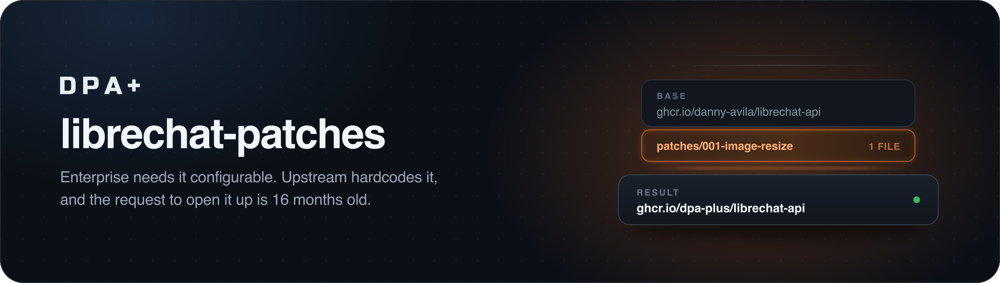

<p align="center">
  
</p>

# librechat-patches

## Why this exists

Running [LibreChat](https://github.com/danny-avila/LibreChat) for an enterprise
customer keeps hitting the same wall: a value that has to be configurable for
this deployment is hardcoded upstream, applied to every endpoint, with no
environment variable and no config key to reach it.

These are rarely controversial changes. Usually somebody has already asked for
them, and often somebody has already written the patch. What is missing is a
merge. The requests behind patch 001 have been open since **April 2025** and
**December 2025**; the related pull request is still a draft.

That is a perfectly reasonable pace for a project maintained by two people. It
is not a pace you can put in front of a customer who needs the setting next
week.

So this repository is the shortcut. We apply the change ourselves, in a form
narrow enough that the shortcut stays cheap — and we offer the same change
upstream, so that one day we can delete it again.

## What it is

A thin overlay on the official image. Each patch takes a value that upstream
hardcodes and makes it configurable — **without changing the default**.

```dockerfile
FROM ghcr.io/danny-avila/librechat-api:v0.8.7
COPY patches/001-image-resize/resize.js /app/api/server/services/Files/images/resize.js
```

That is the whole mechanism. No source fork, no rebased branch, no build of the
application itself.

**This is not a fork and not a distribution.** We track upstream release for
release, we carry as few patched files as we can, and every patch here is
written so it could be merged upstream unchanged. If you can run stock
LibreChat, run stock LibreChat.

## Patches

| # | File | What it opens up | Upstream |
|---|---|---|---|
| [001](./patches/001-image-resize) | `services/Files/images/resize.js` | Image resize ceilings (512 / 768 / 2000 / 1568) via `IMAGE_MAX_*` | [#6777](https://github.com/danny-avila/LibreChat/discussions/6777), [#11065](https://github.com/danny-avila/LibreChat/discussions/11065) — open |

## The rule every patch follows

> **A patch may make something configurable. It may never change behaviour.**

With no environment variables set, a patched image must behave byte-for-byte
like the upstream image it is built from. This is not a style preference, it is
what keeps the overlay small enough to maintain:

- it can be offered upstream as-is, because it costs existing users nothing;
- it cannot silently diverge from upstream behaviour;
- and it keeps deployment-specific values in `.env` where they belong, instead
  of in a patched source file.

The test for any proposed patch is simply: *would upstream accept this?* If the
answer is no, it is not a patch — it belongs in configuration, or in a sidecar
service alongside LibreChat.

## Keeping up with upstream

Every patch directory carries `upstream.sha256`, the checksum of the original
file it was derived from. A scheduled workflow checks each new upstream release
against those checksums:

| Situation | What happens |
|---|---|
| New release, patched files unchanged | PR that only bumps the base tag |
| New release, a patched file changed | Issue with the diff — needs a human |
| No new release | nothing |

So "does the new version break our patches?" is answered by a notification
rather than by archaeology.

## Versioning

Tags mirror upstream: `v0.8.7-dpa.1`, `v0.8.7-dpa.2`. The base version is always
readable from the tag.

Images: `ghcr.io/dpa-plus/librechat-api`.

## Deployment

Deliberately manual. The workflow builds and publishes; rolling out is a
separate, conscious step. A smoke test can prove that the container starts and
that a patch is active — it cannot prove that an agent still talks to its code
interpreter.

## Contributing

Maintained for our own deployments. Issues and pull requests are welcome, but
there is no promised response time.

If you are hitting the same wall — some value your deployment needs to configure
and upstream does not expose — a patch here is a reasonable place to put it,
provided it follows the rule above. And please open or upvote the upstream issue
too. **The goal is to empty this repository, not to grow it.** Every patch that
lands upstream gets deleted here.

## Licence

LibreChat is MIT-licensed, and so is this overlay. The patched files are
derivative works of the originals and retain their copyright.
